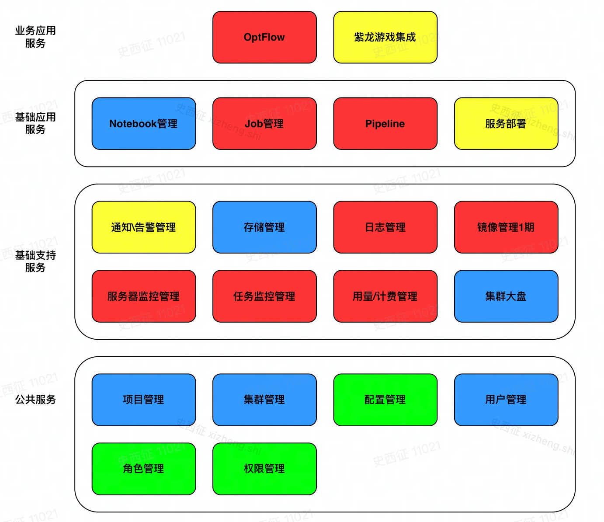

### Doc
[配置](/doc/config.md)

## 微服务模块

| 微服务 | 对应模块 | 服务说明 |
| ---- | ---- | ---- |
| frontend | 前端 | 前端服务 |
| user | 用户管理 | 用户、认证、鉴权服务 |
| cluster | 集群管理 | k8s对接 |
| storage | 存储管理 | 持久化存储管理  |

**微服务间调用**
```bash
# Example: Http方式调用user微服务
curl $USER_SERVICE_HOST:$USER_SERVICE_PORT
```

**微服务模块架构**

